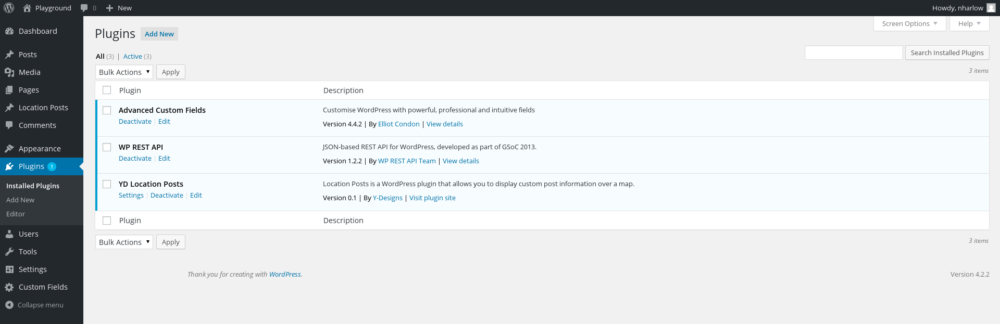
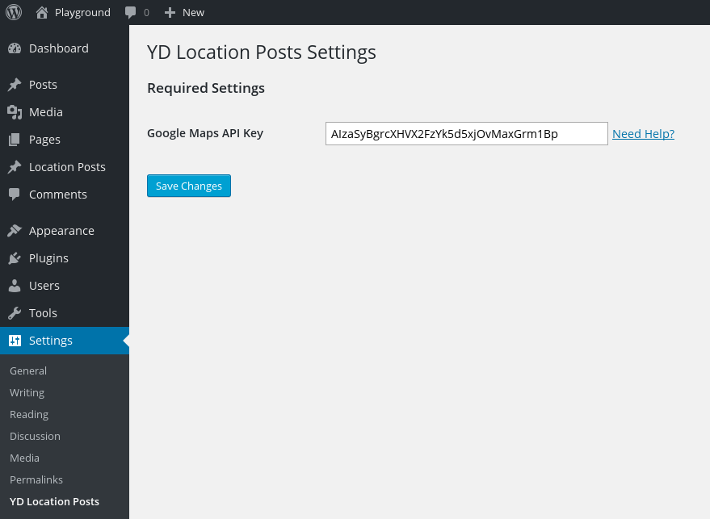
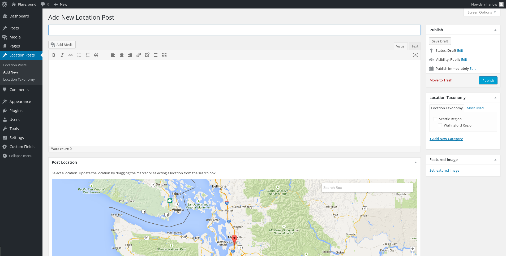
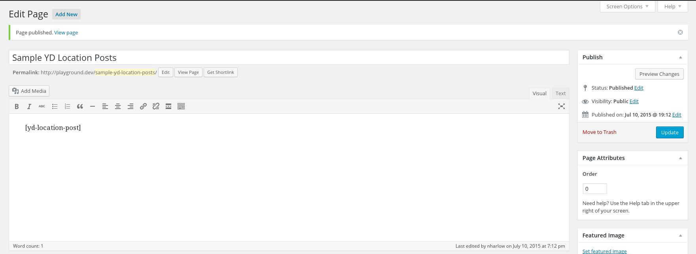
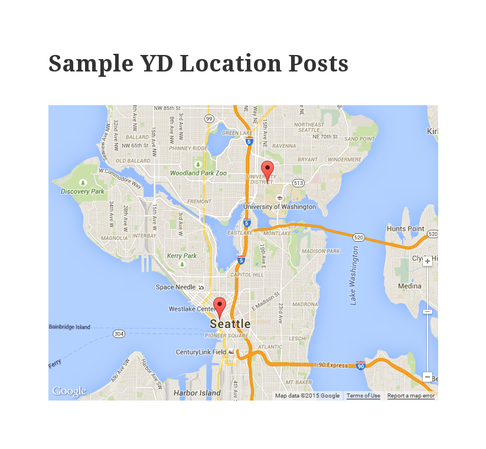
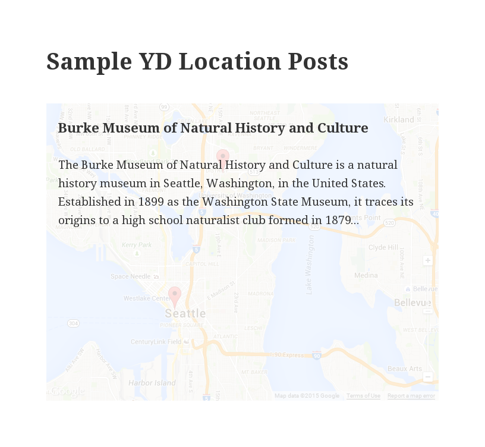
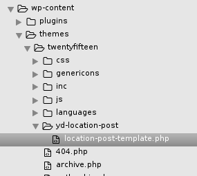

# Location Posts - A Y-Designs WordPress Plugin

The Location Posts plugin is a simple, yet flexible WordPress plugin that ties location based information to a map. You can insert a map within any existing page or post, and also choose which Location Posts you would like to have displayed on the map. This can be something as simple as displaying all of your Location Posts on a map. A more complex example would be displaying only those posts that lie within a geographical bound.

##### [- Getting Started](#user-content-getting-started--installation)
##### [- How to Use](#user-content-how-to-use)
##### [- Parameters](#user-content-parameters)
##### [- Theme Customization](#user-content-theme-customization)
##### [- Compatible Plugins](#user-content-compatible-plugins)
##### [- Developers](#user-content-developers)


## What can I use this plugin for?

A great example would be a real estate website. Assume they want to show a listing of their properties on a map. With the Location Posts plguin they would simply create a Location Post for each property, where they would specify a location along with any other information they would like ( images, title, description, etc.. ). Now all they have to do is insert a shortcode into any existing post or page to have the map show up with their properties. When a user clicks on a property in the map, a modal pops up with any/all of the information in that Location Post.

## Getting Started / Installation

Download this repository and extract the contents into your WordPress plugins directory (`/wp-content/plugins/yd-location-posts`). Or from your plguins directory run the following command:
```
cd /location/to/wp-content/plugins
git clone https://github.com/YD-Seattle/YDLocationPosts.git yd-location-post
```
This plugin has a dependency, so you will also have to install the WP REST API plugin found [here](https://github.com/WP-API/WP-API/tree/1.2.2) or through WordPress's plugin manager (search for `WP REST API (WP API)`). Note the version of WP REST API must be **v1.2.2** (not 2.0).

Once both plugins are installed, active that WP REST API plugin and then active that YD Location Posts plugin. Your plugins screen should look something like this:



## How to Use

**Important!** The first step to using this plugin is to add your Google Maps API key to the YD Location Maps plugin settings. [Need help getting an API key?](https://developers.google.com/maps/documentation/javascript/tutorial#api_key)



Now let's start the fun part! You should see a new item on the admin sidebar labeled `Location Posts`. Hover over this and click `Add New`.



Here you can add content just like you would a normal Post. There is also a map with a marker on it. Drag this marker to a location of your choosing. This will tie a location to the content you add in your Location Post.

After saving and publishing your Location Post, you will probably want to see that content somewhere. We will accomplish this using [shortcodes](https://codex.wordpress.org/Shortcode). As an example, create a new Page, add the following to the page content, and then click draft (or publish). This is the simplest form of our custom shortcode, which displays all published Location Posts.
```
[yd-location-post]
```


In this example, I created/published two Location Posts. By previewing the page you will see both of those locations show up on the goolge map. Clicking on any of the locations will bring up a modal containing the information in that Location Post (such as title, description, image, etc...). Note: this part is fully customizable! You may display whatever information, in any format that you like. Checkout the Templating section.




Sample of content displayed when a user clicks on a marker.


## Parameters

In the previous example we showed you how to use a shortcode to display your information on a map `[yd-location-post]`. Here are the options/parameters to that shortcode to greater fit your needs.

Show all Location Posts.
```
[yd-location-post]
// or
[yd-location-post q='all']
```
Show all posts within a geographical bound. `bounds` is a comma seperated list of lat lng values in the following format: sw_lng,sw_lat,ne_lng,ne_lat. Try this [bounding box tool](http://boundingbox.klokantech.com/) and copy the CSV RAW values. 
```
[yd-location-post q='bounds' bounds='-122.7228302956,47.3838317894,-121.864364624,47.8860850847']
```
Show only posts with the given post_ids.
```
[yd-location-post q='post_ids' post_ids='23, 25']
```

Location Taxonomies: you can now add taxonomies to any of the above queries using the `location_taxonomies` parameter. Ex:
```
[yd-location-post q='all' location_taxonomies='seattle-region']
[yd-location-post q='bounds' bounds='-180,-34.1,180,90' location_taxonomies='portland-region']
```

Available paramets:
- `q`: `all`, `bounds`, `post_ids`
- `bounds`: (Comma seperated list of coordinates in format sw_lng,sw_lat,ne_lng,ne_lat. Ex: '-180,-34.1,180,90' )
- `post_ids`: (Comma seperated list of Location Post ids. Ex: '23,25,29' )
- `location_taxonomies`: (Comma seperated list of Location Taxonomy slugs. Ex: 'seattle-region,sanfransisco-region') (assuming those Location Taxonmies were created!)

## Theme Customization

Customize the way data is presented by overwriting our template in your own theme! First, create the following file (assuming your plugin is installed in /wp-content/plugins/yd-location-post/)
```
/wp-content/themes/your-theme-name/yd-location-post/location-post-template.php
```


This file will be a [handlebars template](http://handlebarsjs.com/). You will have access to all of the fields in your Location Posts, as well as any custom data you have added via the ACF plugin. If you are not sure what fields you have access to, try inspecting the requests being sent for the JSON response to fetch these posts. Below is a sample of what data you might have access to in your handlebars template.
```json
"ID": 25,
"post_author": "1",
"post_date": "2015-07-08 22:06:02",
"post_date_gmt": "2015-07-08 22:06:02",
"post_content": "The Burke Museum of Natural History and Culture is a natural history museum in Seattle, Washington, in the United States. Established in 1899 as the Washington State Museum, it traces its origins to a high school naturalist club formed in 1879...",
"post_title": "Burke Museum of Natural History and Culture",
"post_excerpt": "",
"post_name": "other-post",
"guid": "http:\\/\\/playground.dev\\/?post_type=yd-location-post&#038;p=25",
"menu_order": 0,
"post_type": "yd-location-post",
"lat": "47.660678",
"lng": "-122.31059199999999",
"img": "http:\\/\\/playground.dev\\/uploads/test.png",
"acf": {
	"size": "20000",
	"population": "1250000"
}
```	
Note: the template you are overwriting is the template that is displayed once a user clicks on the map marker!

## Compatible Plugins

#### [Advanced Custom Fields (ACF)](http://www.advancedcustomfields.com/)

## Developers

Developer Docs are coming soon!


***************************************************************************************************


Overall plugin structure cloned from [this skeleton](https://github.com/iandunn/WordPress-Plugin-Skeleton). Thanks!